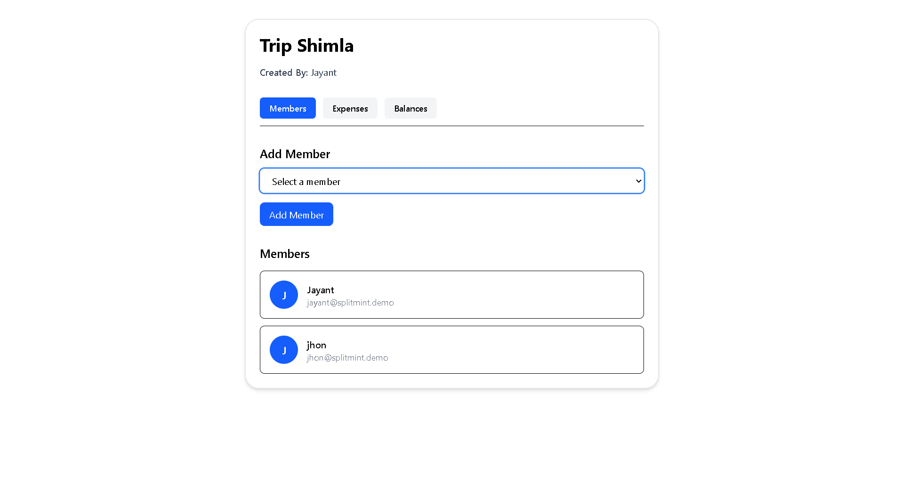
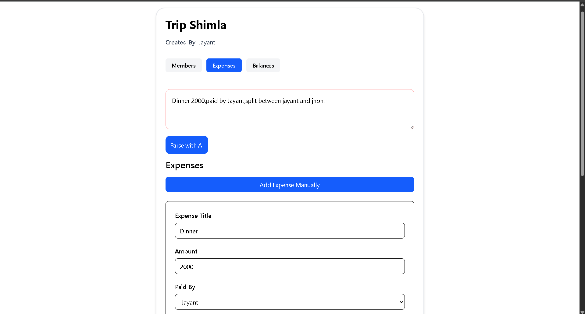
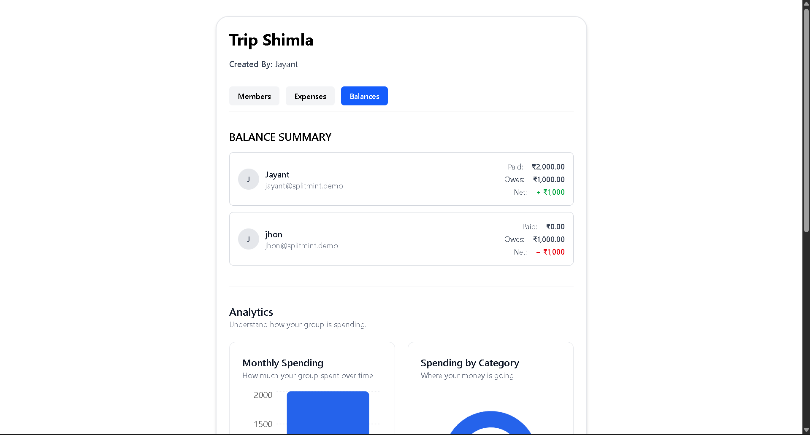

# Splitmint

A modern expense-splitting application for groups to track shared expenses, calculate balances, and manage settlements.

**Live Demo:** [https://split-tracker-phi.vercel.app/](https://split-mint-ruby.vercel.app/)

## ✨ Features

- 🔐 Authentication with Supabase
- 👥 Create groups and manage members
- 💰 Add and split expenses manually
- 🤖 AI-powered expense entry using natural language
- ⚖️ Automatic balance & debt calculation
- 💸 Record and track settlements
- 📊 Group spending analytics
- 📱 Responsive desktop & mobile UI

## 🖥️ Screenshots

<p align="center">
  
  
</p>

<p align="center">
  
  
  
</p>

## 🤖 AI Expense Entry

Splitmint allows users to describe an expense naturally, for example:

> "Dinner 2000, paid by Jayant, split with Jhon and Shorya"

The Gemini API converts the input into structured expense data that can be reviewed before saving.

AI is used for **expense parsing**, while the actual balance and settlement calculations are handled by the application.

## 🛠️ Tech Stack

**Frontend:** React · TypeScript · Vite · Tailwind CSS  
**Backend:** Supabase · PostgreSQL · Supabase Auth  
**AI:** Google Gemini API  
**Charts:** Recharts  
**Deployment:** Vercel

## ⚙️ Run Locally

```bash
git clone <your-repository-url>
cd Split-Mint
npm install
npm run dev
